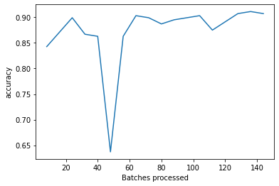
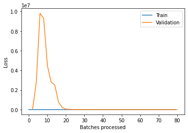
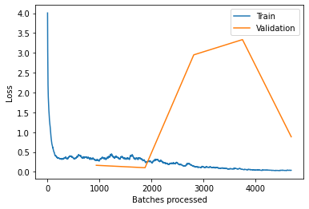

# MIDAS-IIITD-Internship-RA-Task-2021

This repository contains solution to **Task 2 (Computer Vision)** for MIDAS@IIITD Summer Internship/RA 2021.

The whole process has been done on Google Colab GPU Runtime.
***

## Environment Setup
> pip install fastai==1.0.61 

## Steps to Reproduce 

   - Run the `Task2_Part1`, `Task2_Part2`, and `Task2_Part3` notebooks from the `src` directory.
   - All the files used can be accessed from [here](https://drive.google.com/drive/folders/1c6w4uxjPAtZrVR89EHu310E8thWyi4XY?usp=sharing).

***

## Part 1

### Problem Statement
Use this dataset (https://www.dropbox.com/s/pan6mutc5xj5kj0/trainPart1.zip) to train a CNN. Use no other data source or pretrained networks, and explain your design choices during preprocessing, model building and training. Also, cite the sources you used to borrow techniques. A test set will be provided later to judge the performance of your classifier. Please save your model checkpoints.

### Dataset Description

- 2480 images belonging to 62 evenly distributed classes
- Classes include handwritten 0-9 digits and 26 captial + 26 small letters from A-Z 
- Images are of size (1200, 900) 
- A batch of data:

    

**NOTES**: 
- All the reported accuracies are on the validation set unless stated otherwise.
- Losses reported are cross-enrtopy loss except for image size 299 where focal loss is used for optimization

### Approach

- The dataset was split into training/validation using stratifed ratio accoring to class labels of 0.9/0.1

- Training was done in 4 stages using progressive image resizing: `224x224 ->  299x299 -> 512x512 -> 600x600`

- Data Augmentation techniques common to all image sizes: `max_rotate: 10, max_zoom: 1.1, max_lighting: 0.2, max_warp: 0.2, p_affine: 0.75 and p_lighting: 0.75` 

- Base architecture used: ResNet18

- Gradient clipping of 0.1 is done at all stages

#### Image Size 224

**Stage 1**
- Started out with random initialization of ResNet18 architecture 
- Trained model for 30 epochs using the one cycle policy with a maximum learning rate of 3e-2
- Got to an accuracy of 88.71%
- Cross Entropy Loss on training set: 0.6054 and validation set: 0.3277

- **Progress**

|Losses |Accuracies | 
|:-: |:-: |
| |

Learning Rate (One Cycle Policy)

*** 

**Stage 2**
- Started with the pretrained weights from stage 1  
- Added Mixup Augmentation
- Trained using discriminative learning rates (6e-3/100, 6e-3/10, 6e-3), 6e-3 being the lr for the head and the other two being for the earlier layers
- Accuracy : 89.92%
- Loss on training set: 1.7571 and validation set: 0.3585

- **Progress**

|Losses |Accuracies | 
|:-: |:-: |
| |

***
#### Image Size 299

**The loss used for this stage is Focal Loss with alpha=1.0 and gamma=2.0 to bring model's focus on the harder examples**

**Stage 1**
- Started with pretrained weights from stage 2 of model trained on image size 224 
- Added Mixup
- Froze all layers except head
- Fine tuned just the head for 18 epochs with max_lr=1e-2
- Got to an accuracy of 90.73%
- Loss on training set: 1.3728 and validation set: 0.2338

- **Progress**

|Losses |Accuracies | 
|:-: |:-: |
| |

*** 

**Stage 2**
- Started with the pretrained weights from stage 1  
- Unfroze all the layers
- Trained using discriminative learning rate slice(6e-7, 1e-3) which equally distributes learnring rates across all layers
- Accuracy : 90.32%
- Loss on training set: 1.289 and validation set: 0.2269

- **Progress**

|Losses |Accuracies | 
|:-: |:-: |
| |

***

#### Image Size 512

**Stage 1** 
- Started with pretrained weights from stage 2 of model trained on image size 299
- Added Mixup
- Froze all layers except head
- Fine tuned just the head for 12 epochs with max_lr=5e-3
- Got to an accuracy of 91.94%
- Loss on training set: 1.4843 and validation set: 0.3218

- **Progress**

|Losses |Accuracies | 
|:-: |:-: |
| |

*** 

**Stage 2**
- Started with the pretrained weights from stage 1  
- Unfroze all the layers
- Trained for 20 epochs using discriminative learning rate slice(1e-5, 1e-3) which equally distributes learnring rates across all layers
- Accuracy : 91.94%
- Loss on training set: 1.3809 and validation set: 0.2970

- **Progress**

|Losses |Accuracies | 
|:-: |:-: |
| |

***

#### Image Size 600

**Stage 1** 
- Started with pretrained weights from stage 2 of model trained on image size 512
- Froze all layers except head
- Fine tuned just the head for 18 epochs with max_lr=2e-3
- Got to an accuracy of 91.53%
- Loss on training set: 0.2178 and validation set: 0.2378

- **Progress**

|Losses |Accuracies | 
|:-: |:-: |
| |

*** 

**Stage 2**
- Started with the pretrained weights from stage 1  
- Unfroze all the layers
- Trained for 20 epochs using discriminative learning rates [1e-6. 1e-4, 7e-4]
- Best Accuracy : 92.74%
- Loss on training set: 0.1831 and validation set: 0.2166

- **Progress**

|Losses |Accuracies | 
|:-: |:-: |
| |

***

### Analysis

- The validation accuracy went from 88.71% obtained from random initialization to a final accuracy of 92.74%
- The boost of almost over 4% could be attributed to the progressive resizing and fine tuning the previous size image weights

| Set | Loss | Accuracy|
|--- | --- | --- |
| Validation | 0.2170 | 92.74% |
| Training | 0.1194 | 95.54% |

- The training and validation loss go from 0.6054 and 0.3277 to 0.1194 and 0.2170 in the final model
- Also, the final model when validated over the training set gives an accuracy of 95.54% which is very close to the validation accuracy of 92.74%
- Thus, we can say that the model hasn't overfitted on the training set

**Top Losses**

- As we can see from the above plot, most of the top losses are for images of the digit 0 and letter O
- The most confused classes could be attributed to their close similarities to each other 

***
***

## Part 2

**Next, select only 0-9 training images from the above dataset, and use the pretrained network to train on MNIST dataset. Use the standard MNIST train and test splits (http://yann.lecun.com/exdb/mnist/). How does this pretrained network perform in comparison to a randomly initialized network in terms of convergence time, final accuracy and other possible training quality metrics? Do a thorough analysis. Please save your model checkpoints.**

## a) Use 0-9 classes from part 1

### Dataset Description

- Images of handwritten digits from 0-9
- 40 images per class
- Training/ validation split: 0.9/ 0.1 (stratified)
- Image Size (1200, 900)
- A data batch:

 
### Approach
 - Used ResNet18 base architecture with random initialization
 - Trained using One Cycle Policy for 40 epochs and max_lr=1e-1
 - Accuracy obtained: 90%
 - Loss on training set: 0.6091 and validation set: 0.5370

- **Progress**

|Losses |Accuracies | 
|:-: |:-: |
| |

- Trained for 15 more epochs using learning rate slice(6e-7, 2e-3)

- Final Accuracy: 92.50%

- Loss on training set: 0.1454, validation set: 0.4386

***

## b) Use MNIST

### Dataset Description

- Images of handwritten digits from 0-9
- Training images: 50000, Testing images: 10000
- Image Size (28, 28)
- A data batch:

### 1) Train using pretrained weights from a)
 
#### Approach
 - Created databunch with training set from MNIST and testing images as validation set
 - Loaded pretrained weights from a) in ResNet18 architecture
 - Trained using One Cycle Policy for 5 epochs with max_lr=4e-2
 - Accuracy obtained: 99.45%
 - Loss on training set: 0.0302 and testing set: 0.0167

- **Progress**

| Epoch | Train Loss | Test Loss | Accuracy |
|--- | --- | --- | ---|
| 1 | 0.327729 | 0.261087 | 0.939200	|
| 2 | 0.317933	 | 0.166053 | 0.972700 |
| 3 | 0.195614 | 0.129923 | 0.968500|
| 4 | 0.057857	 | 0.030088 | 0.990400|
| 5 | 0.030222	 | 0.016739 | 0.994500|

***

|Losses |Accuracies | 
|:-: |:-: |
| |

***

### 2) Train from scratch
 
#### Approach
 - Created databunch with training set from MNIST and testing images as validation set
 - Used ResNet18 as base architecture with random initialization
 - Trained using One Cycle Policy for 5 epochs with max_lr=4e-2
 - Accuracy obtained: 99.23%
 - Loss on training set: 0.0392 and testing set: 0.8847

- **Progress**

| Epoch | Train Loss | Test Loss | Accuracy |
|--- | --- | --- | ---|
| 1 | 0.300445 | 0.164876 | 0.961200	|
| 2 | 0.262916	 | 0.103552	 | 0.983300 |
| 3 | 0.148213 | 2.951254 | 0.972600|
| 4 | 0.064117	 | 3.336210	 | 0.987500|
| 5 | 0.039002	 | 0.884730 | 0.992300|

***

|Losses |Accuracies | 
|:-: |:-: |
| |

***

### Analysis

- Although the accuracy obtained (93.92%) after the initial epoch when using pretrained weights is lower than that obtained from scratch (96.12%), the final accuracy in pretrained (99.45%) is greater than scratch (99.23%)

- Also, the training when started with pretrained weights is smoother than from scratch as is evident from the loss plots for both the approaches

***
***

## Part 3

**Finally, take the following dataset (https://www.dropbox.com/s/otc12z2w7f7xm8z/mnistTask3.zip), train on this dataset and provide test accuracy on the MNIST test set, using the same test split from part 2. Train using scratch random initialization and using the pretrained network part 1. Do the same analysis as 2 and report what happens this time. Try and do qualitative analysis of what's different in this dataset. Please save your model checkpoints.**

### Dataset Description

- Images of handwritten digits from 0-9
- Number of Images: 60000
- Around 6000 images in each class
- Image Size (28, 28)
- A data batch:
    
    

- MNIST test set as validation set 

### Approach

- The dataset was set as training set and MNIST test set was set as validation set

- Randomly initialized networks with simple CNN and ResNet18 architecture were used 

- Pretrained models from part 2 a) and 2 b) were used 

- Each model was trained for 10 epochs

### Training progress using Random Initialization

|Model |Losses | Accuracies | Final Accuracy | Learning Rate |
|:-: |:-: |:-: |:-: | :-: | :-: |
| Simple ConvNet (One Cycle Policy) |  | | 0.31%| 4e-1 |
| Simple ConvNet (Normal Fit) |  | | 0.99%| 4e-1 |
| ResNet18 |  | | 0.07%| 2e-2 |

***

### Training using pretrained weights 

|Model |Losses | Accuracies | Final Accuracy | learning Rate |
|:-: |:-: |:-: |:-: | :-: | :-: |
| ResNet18 Pretrained (part 2 a) |  | | 0.03%| 4e-2 |
| ResNet18 Pretrained (part 2 b) |  | | 0%| 3e-2 |

***

### Analysis

- As we can see, none of the models work well enough to go beyond an accuracy of even 10%

- The data may have noisy labels

- To confirm this, visual inspection of images from each folder was done 

| Label | Batch of images|
|:-: |:-: |
|1 | |
|3 | |
|7 | |
|8 | |

-  The above table confirms that the dataset contains highly noisy labels

## References 

- [fastai v1](fastai1.fast.ai)
- [One Cycle Policy](https://arxiv.org/abs/1708.07120)
- [Mixup](https://arxiv.org/abs/1710.09412)
